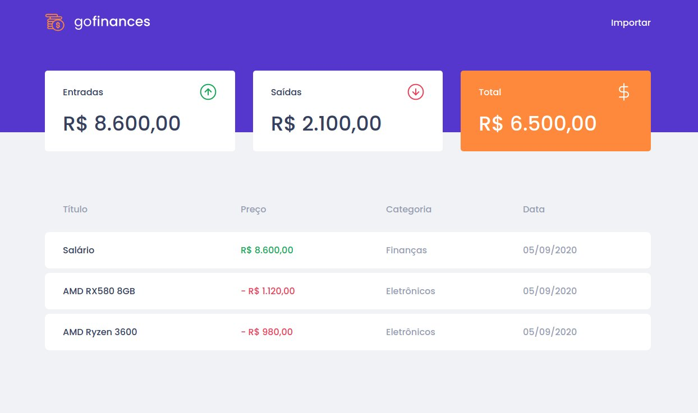
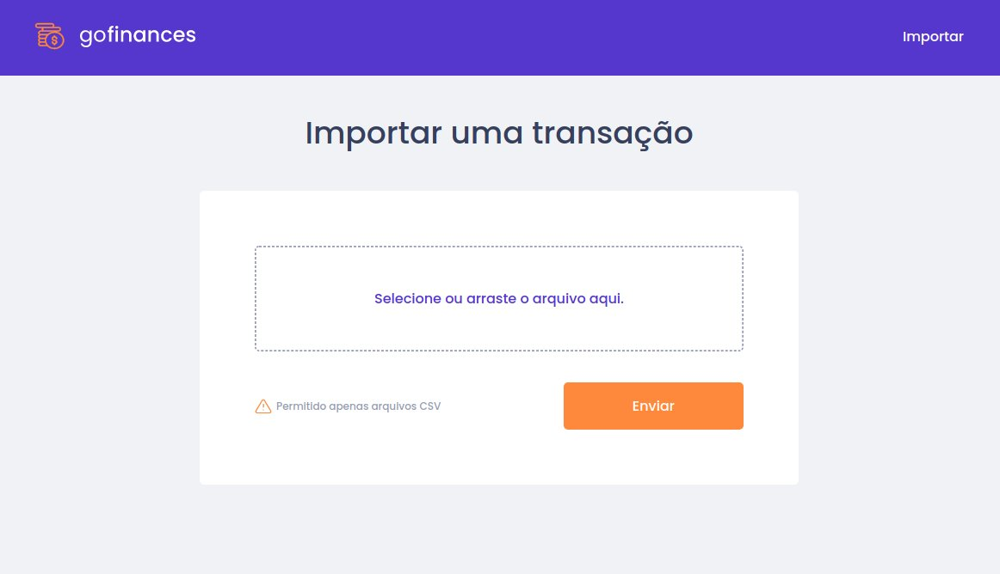

# GoFinances - Projeto Desafio 07

  

> Projeto de transações financeiras desenvolvido durante os desafios NodeJs e ReactJs do GoStack

---

## 📖	Sobre o Projeto

O **GoFinances** é uma plataforma de transações financeiras, listando as entradas e saídas realizadas. Cada transação possui seu tipo, valor, categoria e id próprio.

Neste desafio foi proposto o consumo da api criada durante o [Desafio 06](https://github.com/leovdn/gostack-desafio-database), contendo a base de dados.

Desenvolvido com **React**, **Typescript** e  **Node.js**.
